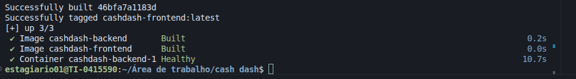
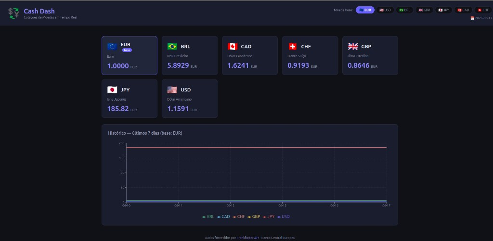

# evidencias de funcionamento — cash dash

---

## docker compose up --build

log completo do build dos dois servicos:

```
Sending build context to Docker daemon  2.912kB
Step 1/8 : FROM python:3.12-slim
 ---> e1054bc5a9f2
Step 2/8 : WORKDIR /app
 ---> Using cache
Step 3/8 : COPY requirements.txt .
 ---> Using cache
Step 4/8 : RUN pip install --no-cache-dir -r requirements.txt
 ---> Using cache
Step 5/8 : COPY . .
 ---> 24b5a4579410
Step 6/8 : EXPOSE 8000
Step 7/8 : CMD ["uvicorn", "app.main:app", "--host", "0.0.0.0", "--port", "8000"]
Successfully built 990226708593
Successfully tagged cashdash-backend:latest

Sending build context to Docker daemon  12.81kB
Step 1/11 : FROM node:20-alpine AS build
Step 2/11 : WORKDIR /app
 ---> Using cache
Step 3/11 : COPY frontend/package*.json ./
 ---> Using cache
Step 4/11 : RUN npm install
 ---> Using cache
Step 5/11 : COPY frontend/ .
 ---> Using cache
Step 6/11 : RUN npm run build
 ---> Using cache
Step 7/11 : FROM nginx:alpine
Step 8/11 : COPY nginx/nginx.conf /etc/nginx/conf.d/default.conf
 ---> Using cache
Step 9/11 : COPY --from=build /app/dist /usr/share/nginx/html
 ---> Using cache
Step 10/11 : EXPOSE 80
Successfully built 46bfa7a1183d
Successfully tagged cashdash-frontend:latest

[+] up 3/3
 ✔ Image cashdash-backend       Built     0.2s
 ✔ Image cashdash-frontend      Built     0.0s
 ✔ Container cashdash-backend-1 Healthy  10.7s
```

> as linhas `Using cache` no backend (steps 2, 3, 4) mostram a estrategia de cache funcionando — o pip install nao rodou de novo porque o requirements.txt nao mudou. o mesmo acontece no frontend com o npm install (steps 3 e 4).



---

## docker ps — containers em execucao

```
CONTAINER ID   IMAGE               COMMAND                  STATUS                      PORTS                                   NAMES
a35a46c6672b   cashdash-backend    "uvicorn app.main:ap…"   Up About an hour (healthy)  8000/tcp                                cashdash-backend-1
29557459bdf3   cashdash-frontend   "/docker-entrypoint.…"   Up About an hour            0.0.0.0:80->80/tcp, [::]:80->80/tcp     cashdash-frontend-1
```

> backend com status `(healthy)` — o healthcheck batendo no `/health` do fastapi passou. frontend expondo a porta 80 pro host. a porta 8000 do backend nao aparece exposta ao host, so acessivel internamente pelo nginx.


---

## logs do backend — requisicoes em tempo real

```
backend-1   | INFO:     127.0.0.1:55834 - "GET /health HTTP/1.1" 200 OK
backend-1   | INFO:     127.0.0.1:58602 - "GET /health HTTP/1.1" 200 OK
backend-1   | INFO:     172.21.0.3:34724 - "GET /api/v1/cotacoes HTTP/1.1" 200 OK
backend-1   | INFO:     172.21.0.3:52964 - "GET /api/v1/historico/EUR HTTP/1.1" 200 OK
backend-1   | INFO:     172.21.0.3:34712 - "GET /api/v1/cotacoes/USD HTTP/1.1" 200 OK
backend-1   | INFO:     172.21.0.3:34722 - "GET /api/v1/historico/USD HTTP/1.1" 200 OK
```

> as requisicoes de `127.0.0.1` sao o healthcheck do docker. as de `172.21.0.3` sao o nginx repassando as chamadas do frontend — confirmando que a comunicacao entre containers pela rede interna esta funcionando.

---

## aplicacao acessivel no navegador


